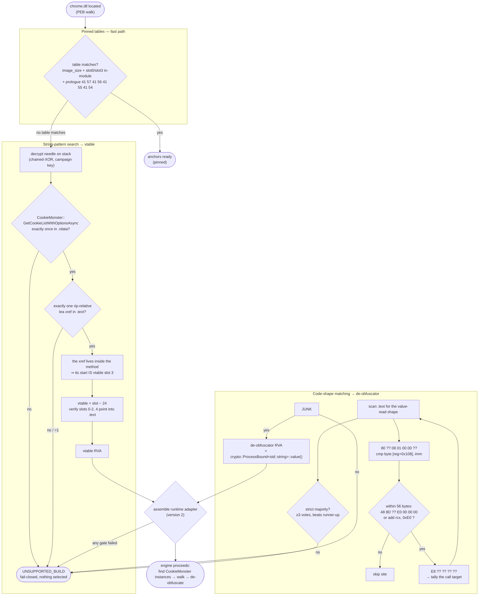

# Runtime anchor discovery — visual walkthrough

How the blob selects its two Engine anchors on any Chrome build:
the **pinned fast-path** and, when nothing matches, the two
**byte-pattern chains** described in the
[README](../README.md#how-it-works--in-brief). The de-obfuscator chain
locates `crypto::ProcessBound<std::string>::value()` — Chrome's
process-bound decryption routine — by recognizing the code that calls it.

Every diamond is a fail-closed gate: ambiguity selects nothing.
