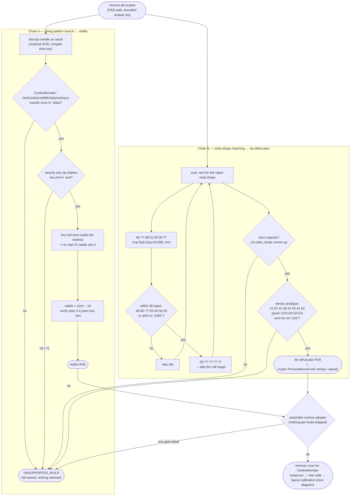
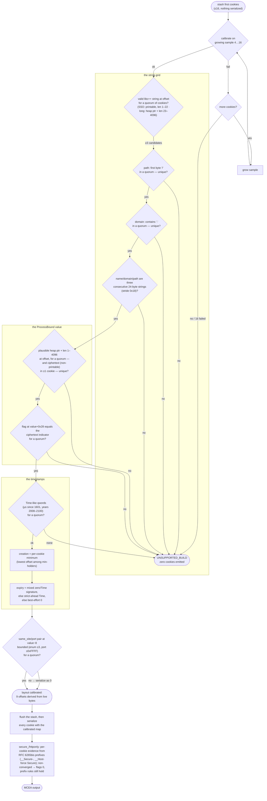

# Runtime discovery — visual walkthrough

How the blob orients itself on **any** Chrome build with zero per-build
knowledge. Nothing here is memorized: every anchor and every struct
offset is derived from the bytes of the build actually in memory, at
every execution. Two layers:

1. **Anchor discovery** (`src/adapter.c`) — where the CookieMonster
   vtable and Chrome's de-obfuscation routine live in `chrome.dll`;
2. **Per-run layout calibration** (`src/cc_layout.c`) — where every
   field lives inside the cookie objects themselves.

Every diamond is a fail-closed gate: ambiguity selects nothing.

## 1 — Anchor discovery (byte-pattern chains on the DLL)

## 2 — Per-run cookie layout calibration (`src/cc_layout.c`)

The walk starts, but **nothing is serialized yet**: the first cookies
are stashed and the struct map is derived from their bytes by
cross-instance invariants, under a strict-majority quorum (> n/2) that
tolerates legal oddities (empty values, empty names, a corrupt cookie).

## Why per-run

A patch-level rebuild that moves a field (the `.57` → `.58` lesson:
identical image size, code shifted) cannot make the engine misread:
either the invariants hold on the new bytes and the new layout is
derived correctly, or they do not and the run fails closed. The failure
mode went from *silently corrupted cookies* to *refuses to guess*.
